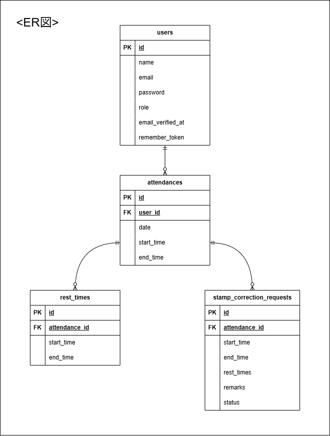

# coachtech-attendance

## アプリケーション概要
- Laravel 8 を使用した勤怠管理アプリケーションです。
- Dockerで開発環境を構築可能。

### 主な機能
#### 一般ユーザー
- **認証**: 会員登録（Mailtrapによるメール認証）、ログイン
- **打刻**: 出勤、退勤、休憩開始、休憩終了
- **一覧表示**: 自身の月次勤怠一覧の確認
- **申請**: 勤怠データの修正申請機能（管理者への申請）

#### 管理者
- **勤怠管理**: 全スタッフの日次勤怠一覧・詳細の確認、CSV出力
- **ユーザー管理**: スタッフ一覧の確認、スタッフ別勤怠の表示
- **承認フロー**: ユーザーからの修正申請に対する承認処理

---

## 環境構築手順

1. **リポジトリをクローン**
```bash
git clone git@github.com:saito-himeka/coachtech-attendance.git
cd coachtech-attendance
```

2. **Dockerコンテナを起動**
```bash
docker-compose up -d --build
```

3. **プロジェクト直下で、以下のコマンドを実行する**
```bash
make init
```


## PHPUnitを利用したテスト
```bash
make test
```

## 使用技術/バージョン
- **Backend**: Laravel 8.83.29 (PHP 8.1.33)
- **Frontend**: Blade, CSS, JavaScript
- **Database**: MySQL 8.0.26
- **Infrastructure**: Docker, Nginx 1.21.1
- **Tool**: MailHog（メールテスト用）

## メール認証の設定 (MailHog)
ローカルでのメール送信テストには MailHog を使用しています。
ブラウザで以下のURLにアクセスすることで、送信されたメールの内容をリアルタイムで確認できます。
- **MailHog管理画面**: http://localhost:8025
※ .env の MAIL_HOST には mailhog を設定してください。


## テストアカウント

### 管理者
- **name**:管理者
- **email**:admin@example.com
- **password**:password123

### 一般ユーザー
#### ユーザー1
- **name**:山田太郎
- **email**:yamada@example.com
- **password**:password123
#### ユーザー2
- **name**:佐藤花子
- **email**:sato@example.com
- **password**:password123
#### ユーザー3
- **name**:鈴木一郎
- **email**:suzuki@example.com
- **password**:password123


## URL
- 開発環境:http://localhost
- ユーザー登録:http://localhost/register
- MailHog (メール確認): http://localhost:8025
- phpMyAdmin:http://localhost:8080
    - ユーザー名:laravel_user
    - パスワード:laravel_pass

## テーブル仕様書

| カラム名 | 型 | primary key | unique key | not null | foreign key |
| --- | --- | --- | --- | --- | --- |
| id | unsigned bigint | ○ | | ○ | |
| name | verchar(255) ||| ○ ||
| email | verchar(255) |  | ○ | ○ |  |
| password | verchar(255) |  |  | ○ |  |
| role | tinyint |  |  | ○ |  |
| email_verified | timestamp |  |  |  |  |
| remember_token | verchar(255) |  |  |  |  |
| created_at | timestamp |  |  |  |  |
| updated_at | timestamp |  |  |  |  |

erDiagram
    users ||--o{ attendances : "1対多"
    attendances ||--o{ rest_times : "1対多"
    attendances ||--o{ stamp_correction_requests : "1対多"

    users {
        unsigned_bigint id PK
        varchar_255 name "NOT NULL"
        varchar email UK "NOT NULL"
        varchar password "NOT NULL"
        tinyint role "NOT NULL"
        timestamp email_verified_at
        varchar remember_token
        timestamp created_at
        timestamp updated_at
    }

    attendances {
        unsigned_bigint id PK
        unsigned_bigint user_id FK "NOT NULL"
        date date "NOT NULL"
        time start_time "NOT NULL"
        time end_time
        timestamp created_at
        timestamp updated_at
    }

    rest_times {
        unsigned_bigint id PK
        unsigned_bigint attendance_id FK "NOT NULL"
        time start_time "NOT NULL"
        time end_time
        timestamp created_at
        timestamp updated_at
    }

    stamp_correction_requests {
        unsigned_bigint id PK
        unsigned_bigint attendance_id FK "NOT NULL"
        time start_time
        time end_time
        json rest_times
        text remarks "NOT NULL"
        tinyint status "NOT NULL"
        timestamp created_at
        timestamp updated_at
    }

## ER図



